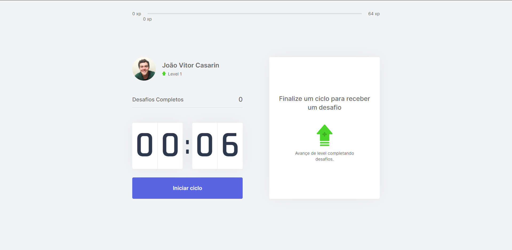

<h1 align="center">
  <a href="https://github.com/joaocasarin/moveit-nlw4">
    
  </a>
</h1>

<p align="center">Move.it is a project created by Rocketseat initially to be a platform that combines the technique of pomodoro, which consists of alternating cycles of focus and rest, with exercises for well-being for those who spend many hours in front of a computer, which can be harmful to health when you do no exercise or take periods of rest!</p>

<p align="center">
  <a href="https://github.com/joaocasarin">
    
  </a>

  

  
</p>

<p align="center">
  
  
  
</p>

---

## Table of Contents

<ul>
  <li><a href="#-getting-started">Getting Started</a></li>
  <li><a href="#-features">Features</a></li>
  <li><a href="#-contributing">Contributing</a></li>
  <li><a href="#-support">Support</a></li>
</ul>

---

## 🚀 Getting Started

### Prerequisites

- To run any ReactJS application you need to configure the environment on your machine.

- Setting the environment is a simple process, so it's recommended to follow the Rocketseat guide which is currently the most complete and detailed to make the settings:

#### [**Rocketseat Guide**](https://www.notion.so/Configura-es-do-ambiente-React-76f2963a042f45b9b9b567a2795945b8)

### Clone

- Clone this repo to your local machine using:

```
https://github.com/joaocasarin/moveit-nlw4
```

### Setup

- Install project dependencies;
  - ```javascript
    yarn install
    // or
    npm install
    ```
- Run project in development mode;

  - ```javascript
    yarn dev
    // or
    npm run dev
    ```
- Be Happy! 😆

---

## 📋 Features

### Documentation

- [ ] WIP ...

### Build with

- [ReactJS](https://reactjs.org/) - A JavaScript library for building user interfaces
- [Typescript](https://www.typescriptlang.org/) - TypeScript is an open-source language which builds on JavaScript, one of the world’s most used tools, by adding static type definitions.
- [Next.JS](https://nextjs.org/) - Next.js gives you the best developer experience with all the features you need for production: hybrid static & server rendering, TypeScript support, smart bundling, route pre-fetching, and more. No config needed.

---

## 🤔 Contributing

> To get started...

### Step 1

- 🍴 Fork this repo!

### Step 2

- 👯  Clone this repo to your local machine using `https://github.com/joaocasarin/moveit-nlw4`

### Step 3

- 🎋  Create your feature branch using `git checkout -b my-feature`

### Step 4

- ✅  Commit your changes using `git commit -m 'feat: My new feature'`;

### Step 5

- 📌  Push to the branch using `git push origin my-feature`;

### Step 6

- 🔃  Create a new pull request

After your Pull Request is merged, you can delete your feature branch.

---

## 📌 Support

Reach out to me at one of the following places!

- Linkedin at [Joao Casarin](https://www.linkedin.com/in/joaocasarin/)
- Instagram at [Joao Casarin](https://www.instagram.com/joaocasarin)

---

Made with 💙  Enjoy it!